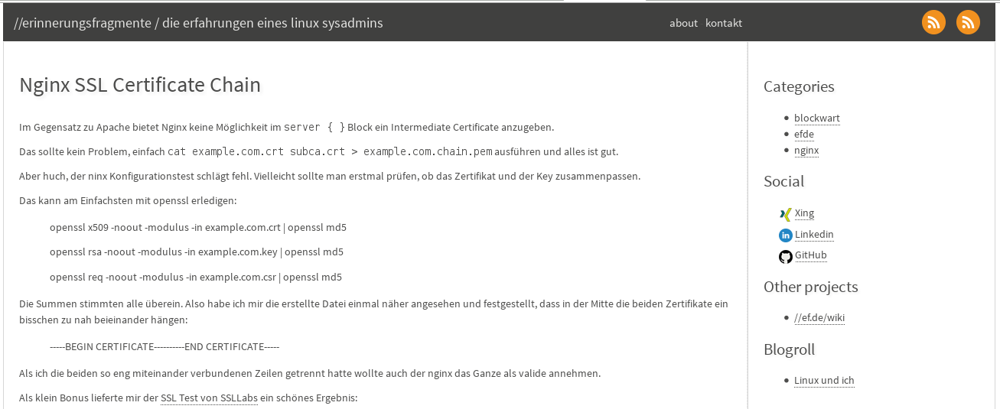

# simplegrey #

Originally deleveloped by [Fle](https://github.com/fle/pelican-simplegrey).
This repo will track the changes I've made for [//erinnerungsfragmente.de](https://erinnerungsfragmente.de).

*Not in use anymore. Please take a look at [droidstrap](https://github.com/rullmann/droidstrap)*

## Screenshot ##

## Options ##

* Removed the Twittercard feature and Twitter Share Button by Fle
* Disqus comment plugin option has been removed.
* Added 'MYLINKS' option. On the sidebar you have the part 'Other projects'. Simply add some links to your config.

## Other changes ##

* Minor bug fixes
* Xing social account has an image now.

## Credits ##

* Theme freely inspired by [vkvn](https://github.com/vkvn)
* Icons by [Jorge Calvo](http://dribbble.com/shots/1074961-Flat-Icons-EPS), slightly adapted by [Ingrid Hamard](http://ingrid.hamard.free.fr)

